<div align="center">

# Sistem Penjadwalan Perkuliahan Otomatis Menggunakan Constraint Programming

### [Tagline Singkat dan Menarik]

[](https://sisjadwal.afiefnoer.my.id/])

[](https://[github.com/afiffaizin/sistem-penjadwalan.git])

[](LICENSE)

**Submission for ITECHNO CUP 2026 - Web Development**

**By 404 Forbidden**

## </div>

## 📋 Daftar Isi

- [Tentang Proyek](#-tentang-proyek)
- [Fitur Unggulan](#-fitur-unggulan)
- [Demo & Screenshot](#-demo--screenshot)
- [Teknologi](#%EF%B8%8F-teknologi)
- [Arsitektur Sistem](#%EF%B8%8F-arsitektur-sistem)
- [Instalasi & Setup](#%EF%B8%8F-instalasi--setup)
- [Penggunaan](#-penggunaan)
- [API Documentation](#-api-documentation)
- [Testing](#-testing)
- [Tim Developer](#-tim-developer)
- [Lisensi](#-lisensi)

---

## 👥 Tim Developer

| Nama                            | Peran               | GitHub                                      |
| ------------------------------- | ------------------- | ------------------------------------------- |
| **Davu Andrias Dzakwan**        | Project Lead        | [GitHub](https://github.com/davuad)         |
| **Afif Nur Faizin**             | Fullstack Developer | [GitHub](https://github.com/afiffaizin])    |
| **Valenisaa Falaq Hendratmoko** | Technical Writer    | [GitHub](https://github.com/ValenisaaFalaq) |

## 🎯 Tentang Proyek

### Latar Belakang

Penjadwalan perkuliahan adalah proses administratif yang harus mengakomodasi dosen, mata kuliah, kelas, ruang, dan waktu secara bersamaan tanpa menimbulkan konflik. Kompleksitas ini meningkat pada institusi pendidikan yang memiliki banyak program studi dan ruang yang dipakai bersama lintas program studi. Sebagai konteks implementasi awal, sistem ini dikembangkan berdasarkan studi kasus pada sebuah jurusan dengan 5 program studi, 56 dosen, dan 60 mata kuliah per semester, dengan 25 ruang perkuliahan yang dipakai bersama. Sebagian ruang terutama laboratorium praktikum hanya bisa digunakan oleh program studi tertentu, sehingga penjadwalan harus mempertimbangkan kesesuaian antara mata kuliah, program studi, dan ketersediaan fasilitas. Pola kebutuhan seperti ini umum ditemukan pada institusi pendidikan dengan struktur jurusan/program studi serupa.

Pada umumnya, proses penyusunan jadwal di institusi semacam ini masih dilakukan secara konvensional: pengelola akademik memeriksa ketersediaan ruang, lalu menyesuaikannya secara manual dengan tugas mengajar masing-masing dosen. Hasilnya dibagikan dalam satu dokumen kepada dosen dan mahasiswa. Cara ini memakan waktu lama dan rentan menimbulkan kesalahan bila tidak diperiksa secara menyeluruh, termasuk konflik jadwal dosen, konflik penggunaan ruang, dan bentrok jadwal mahasiswa.

Kompleksitas bertambah ketika ada permintaan khusus dari dosen, misalnya ketersediaan mengajar yang terbatas pada hari tertentu, yang tetap harus dipenuhi tanpa mengganggu jadwal dosen lain, kelas, atau ruang. Dalam proses manual, hal ini sering memerlukan penyesuaian berulang sehingga berpotensi menimbulkan inkonsistensi dan memperpanjang waktu penyusunan jadwal.

Masalah lain terletak pada keterbatasan cara penyajian jadwal: hasil penjadwalan yang ada belum bisa ditampilkan secara fleksibel sesuai kebutuhan pengguna, padahal jadwal idealnya dapat diakses dari berbagai sudut pandang, per dosen, kelas, ruang, maupun program studi.

Berdasarkan permasalahan tersebut, dikembangkan sistem penjadwalan perkuliahan terkomputerisasi untuk menyusun jadwal secara lebih terstruktur dan meminimalkan konflik, yang dirancang agar dapat diadaptasi pada institusi pendidikan lain dengan kebutuhan penjadwalan serupa. Pengembangan pada tahap ini difokuskan pada constraint utama, konflik dosen, konflik penggunaan ruang, dan keterbatasan ruang, sementara akomodasi preferensi waktu mengajar dosen menjadi bagian pengembangan lanjutan di luar cakupan sistem saat ini.

### Solusi yang Ditawarkan

Sistem ini menyelesaikan masalah penjadwalan dengan pendekatan Constraint Programming (CP): aturan-aturan yang wajib dipenuhi (constraint) didefinisikan terlebih dahulu, lalu sistem mencari kombinasi jadwal yang memenuhi seluruh aturan tersebut secara otomatis, alih-alih disusun manual satu per satu.

Secara teknis, sekretaris jurusan mengunggah data master (dosen, mata kuliah beserta SKS, dan ketersediaan ruang) dalam format Excel. Data ini melewati proses pembersihan (data cleansing) untuk mendeteksi ketidaksesuaian atau duplikasi sebelum diproses lebih lanjut. Perhitungan jadwal dijalankan oleh mesin penjadwalan (scheduling engine) berbasis Google OR-Tools dengan solver CP-SAT.
Delapan hard constraint diterapkan pada proses ini:

- **Dosen tidak bentrok** - satu dosen tidak bisa mengajar di dua tempat dalam waktu bersamaan.
- **Kelas tidak bentrok** - satu rombongan belajar tidak bisa mengikuti dua mata kuliah sekaligus.
- **Ruangan tidak bentrok** - satu ruangan tidak bisa dipakai dua kelas sekaligus.
- **Shalat Jumat** - sesi ke-5 pada hari Jumat wajib dikosongkan.
- **Cuti/libur dosen** - dosen tidak dijadwalkan pada hari yang tidak bisa mengajar.
- **Urutan sesi** - sesi teori wajib mendahului sesi praktikum, untuk dosen maupun grup mata kuliah yang sama.
- **Kategori ruangan** - mata kuliah teori dan praktikum wajib ditempatkan pada tipe ruangan yang sesuai.
- **Ruangan spesifik** - bila diatur, mata kuliah tertentu hanya bisa dijadwalkan pada ruangan yang telah ditunjuk.

Selain kedelapan hard constraint tersebut, sistem juga menerapkan satu preferensi berbasis penalti (soft constraint) untuk penempatan ruang praktikum: solver mengutamakan ruangan sesuai program studi pengampu mata kuliah, dan baru mempertimbangkan ruangan lintas program studi bila tidak ada pilihan yang lebih sesuai

Dibanding proses manual, pendekatan ini mengganti pengecekan satu per satu oleh pengelola akademik dengan pencarian kombinasi otomatis yang mempertimbangkan seluruh constraint sekaligus, sehingga potensi konflik jadwal dapat ditekan tanpa memerlukan penyesuaian berulang.

Hasil penjadwalan dapat ditampilkan dari berbagai sudut pandang (per dosen, kelas, ruang, dan program studi), dengan hak akses berbeda untuk Sekretaris Jurusan, Kepala Jurusan, dan Koordinator Program Studi, serta tampilan publik bagi dosen dan mahasiswa. Jadwal yang sudah jadi dapat diunduh dalam format PDF atau Excel. Pendekatan ini membantu sekretaris jurusan menyusun dan mendistribusikan jadwal, serta memudahkan dosen dan mahasiswa mengakses informasi jadwal sesuai kebutuhan masing-masing.

### Tujuan Proyek

- 🎯 **Tujuan Utama**: Menyediakan sistem penjadwalan perkuliahan berbasis web yang mampu menghasilkan jadwal kuliah bebas konflik secara otomatis menggunakan Constraint Programming, sekaligus menyajikan hasil jadwal dari berbagai sudut pandang agar lebih mudah diakses oleh seluruh pengguna, dirancang agar konsep dan mekanismenya dapat diadaptasi oleh institusi pendidikan lain dengan struktur
- 📊 **Target Pengguna**:
  - **Sekretaris Jurusan**, mengelola data master, mengunggah dan memvalidasi data, menjalankan proses generate jadwal, serta mengelola data jadwal yang dihasilkan.
  - **Kepala Jurusan (Kajur)**, memantau dashboard statistik jurusan dan seluruh jadwal perkuliahan, serta mengunduh jadwal.
  - **Koordinator Program Studi (Kaprodi)**, memantau dashboard statistik dan jadwal perkuliahan pada program studinya masing-masing.
  - **Dosen dan Mahasiswa**, mengakses jadwal melalui landing page dengan filter mata kuliah, ruang, waktu, dan kelas, serta mengunduh jadwal dalam format PDF.
- 💡 **Value Proposition**: Dibanding proses manual yang bergantung pada pengecekan visual satu per satu, sistem ini menjalankan pencarian kombinasi jadwal berbasis constraint yang memeriksa seluruh aturan (bentrok dosen, ruang, dan kelas) secara bersamaan, sehingga jadwal yang dihasilkan bebas konflik tanpa memerlukan penyesuaian berulang. Sistem juga menyajikan jadwal dari berbagai sudut pandang dengan hak akses yang dipisahkan sesuai peran, sehingga masing-masing pengguna dapat mengakses informasi jadwal yang relevan tanpa harus menyaring satu dokumen tunggal secara manual. Model constraint yang digunakan berbasis pada aturan-aturan penjadwalan yang umum berlaku di institusi pendidikan berstruktur jurusan/program studi, sehingga secara konseptual dapat disesuaikan untuk konteks institusi lain.

---

## ✨ Fitur Unggulan

### Fitur Utama

| Fitur                                             | Deskripsi                                                                                                                                                                                                                                                                                                                                                                                                                                                                                                                                                                                                                                                                                                                                                      | Keunggulan                                                                                                                                                                                         |
| ------------------------------------------------- | -------------------------------------------------------------------------------------------------------------------------------------------------------------------------------------------------------------------------------------------------------------------------------------------------------------------------------------------------------------------------------------------------------------------------------------------------------------------------------------------------------------------------------------------------------------------------------------------------------------------------------------------------------------------------------------------------------------------------------------------------------------- | -------------------------------------------------------------------------------------------------------------------------------------------------------------------------------------------------- |
| **Auto-Generate Jadwal (Constraint Programming)** | Fitur inti sistem. Sekretaris Jurusan cukup menekan satu tombol untuk menjalankan scheduling engine berbasis Google OR-Tools dengan solver CP-SAT. Sistem menghitung kombinasi jadwal terhadap delapan hard constraint yang telah ditetapkan: mata kuliah dijadwalkan tepat satu kali, SKS berjalan kontinu, tidak ada bentrok ruang, tidak ada bentrok dosen, tidak ada bentrok kelas mahasiswa, slot istirahat Jumat dikosongkan, cuti/libur dosen dihormati, urutan sesi teori mendahului praktikum, kesesuaian kategori ruangan, dan ruangan spesifik bila diatur. Selain itu, sistem juga menerapkan satu soft constraint berupa preferensi penempatan ruang praktikum sesuai program studi pengampu sebelum mempertimbangkan ruang lintas program studi. | Menggantikan penyusunan manual dengan pencarian solusi otomatis yang memeriksa seluruh batasan sekaligus, menghasilkan jadwal mingguan tanpa konflik dosen maupun ruang hanya dalam satu eksekusi. |
| **Manajemen Data Master**                         | Mengelola seluruh data dasar perkuliahan secara terpusat: akun pengguna, tahun akademik, semester, program studi, rombongan kelas, dosen, mata kuliah beserta SKS, hingga ketersediaan ruangan, mencakup 6 modul Master Data (Program Studi, Dosen, Mata Kuliah, Ruangan, Kelas, Plotting Dosen).                                                                                                                                                                                                                                                                                                                                                                                                                                                              | Seluruh data akademik yang menjadi input penjadwalan berada dalam satu sistem terpusat, bukan tersebar di banyak dokumen terpisah.                                                                 |
| **Pembersihan Data Otomatis (Data Cleansing)**    | Memvalidasi dataset dosen, mata kuliah, dan ruangan yang diunggah dalam format Excel. Sistem otomatis mendeteksi data ganda, tidak sinkron, kolom kosong, atau format tidak sesuai sebelum data digunakan pada tahap Generate.                                                                                                                                                                                                                                                                                                                                                                                                                                                                                                                                 | Kualitas data diperiksa secara otomatis sebelum masuk proses penjadwalan, sehingga potensi kesalahan input tidak ikut terbawa ke hasil jadwal.                                                     |
| **Pemantauan Jadwal Multi-Perspektif**            | Menyajikan hasil jadwal dari berbagai sudut pandang (dosen, kelas, ruangan, program studi) dengan hak akses terpisah untuk Sekretaris Jurusan, Kepala Jurusan, dan Koordinator Program Studi.                                                                                                                                                                                                                                                                                                                                                                                                                                                                                                                                                                  | Setiap role memperoleh cakupan data sesuai kewenangannya (jurusan vs. per program studi) tanpa perlu menyaring satu dokumen jadwal yang sama secara manual.                                        |
| **Cetak dan Ekspor Jadwal**                       | Mengunduh hasil akhir matriks jadwal mingguan ke dalam file Excel atau PDF secara instan, siap didistribusikan kepada dosen dan mahasiswa.                                                                                                                                                                                                                                                                                                                                                                                                                                                                                                                                                                                                                     | Jadwal yang sudah tervalidasi langsung tersedia dalam format siap distribusi tanpa proses ekspor manual tambahan.                                                                                  |

### Fitur Tambahan

- **Pencarian Jadwal Publik** - Halaman utama sistem dapat diakses tanpa login oleh siapa pun, termasuk mahasiswa dan masyarakat umum. Pengguna dapat mencari jadwal menggunakan kombinasi filter Program Studi, Dosen Pengajar, Kelas, dan Ruangan, baik seluruh filter maupun hanya sebagian.
- **Ubah/Tukar Jadwal** - Pada halaman Hasil Jadwal, Sekretaris Jurusan dapat mengubah atau menukar jadwal secara langsung, dengan sistem tetap mempertimbangkan potensi konflik terhadap jadwal lain saat perubahan dilakukan.
- **Manajemen User** - Sekretaris Jurusan dapat menambah, mengedit, dan menghapus akun Kepala Jurusan serta Koordinator Program Studi, termasuk mengatur nama, username, email, password awal, dan jabatan/role.
- **Dashboard Statistik Akademik** - Sekretaris Jurusan, Kepala Jurusan, dan Koordinator Program Studi masing-masing memperoleh ringkasan data akademik berupa kartu indikator dan grafik, distribusi tipe mata kuliah (teori/praktikum/campuran), distribusi beban SKS per program studi, peringkat 5 dosen dengan beban SKS tertinggi, serta kepadatan jadwal per hari, dengan cakupan data yang disesuaikan pada level kewenangan masing-masing role.
- **Request Hari Tidak Bisa Mengajar** - Permintaan ini mencakup kondisi di mana dosen menentukan batasan hari atau jam tertentu di mana mereka tidak bersedia/tidak bisa mengajar, termasuk penyesuaian untuk dosen yang memiliki izin khusus atau jadwal Work From Home (WFH).

---

## 📸 Demo & Screenshot

### Live Demo

🔗 **[Kunjungi Website](https://sisjadwal.afiefnoer.my.id/)**

### Screenshot Aplikasi

<div align="center">
 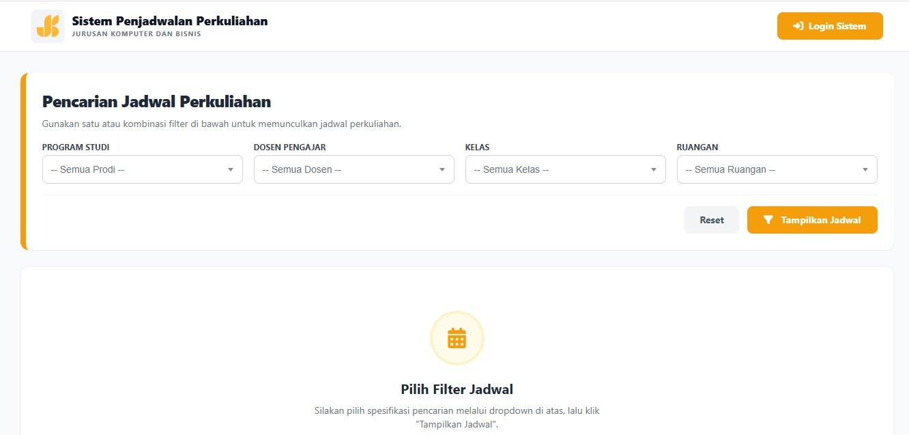
 <p><em>Halaman Utama - halaman awal yang dapat diakses siapa saja tanpa login, memungkinkan pengguna mencari jadwal perkuliahan menggunakan kombinasi filter Program Studi, Dosen Pengajar, Kelas, dan Ruangan</em></p>

 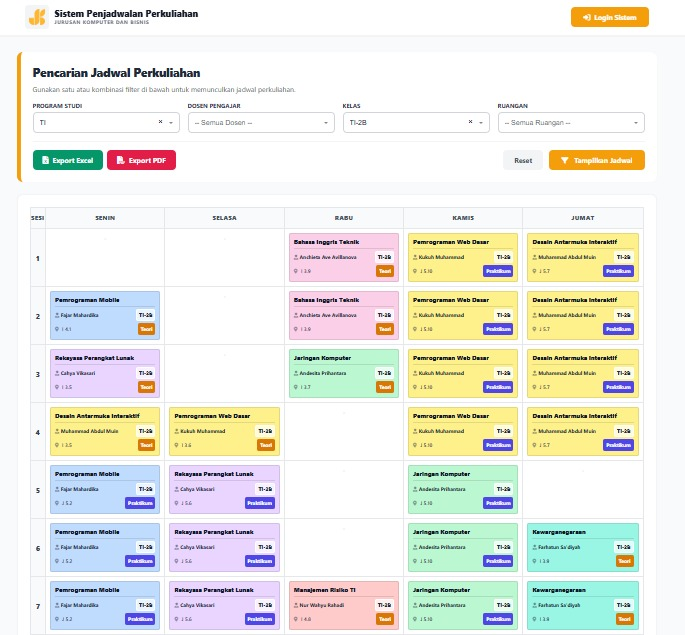
 <p><em>Halaman Utama - halaman awal yang dapat diakses siapa saja tanpa login, memungkinkan pengguna mencari jadwal perkuliahan menggunakan kombinasi filter Program Studi, Dosen Pengajar, Kelas, dan Ruangan</em></p>

 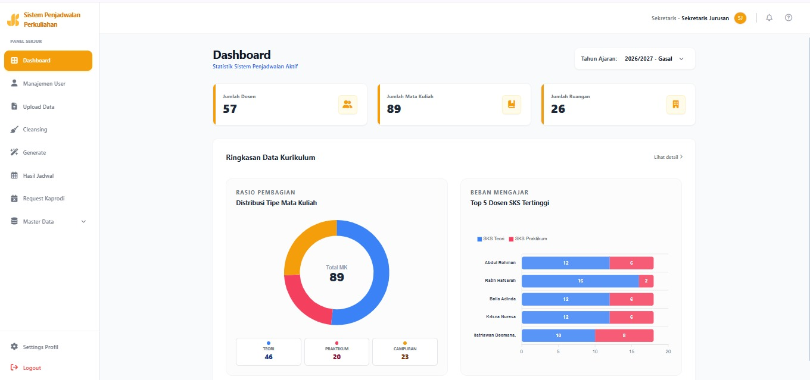
 <p><em>Halaman Dashboard [Sekretaris Jurusan] - menampilkan ringkasan data akademik secara real-time berupa jumlah dosen, mata kuliah, dan ruangan, dilengkapi grafik distribusi tipe mata kuliah dan peringkat 5 dosen dengan beban SKS tertinggi.</em></p>

 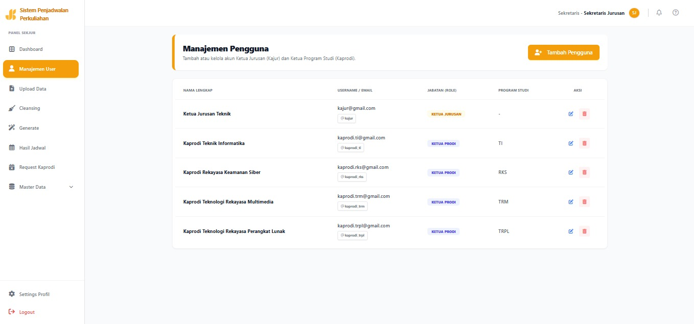
 <p><em>Halaman Manajemen User [Sekretaris Jurusan] - halaman bagi Sekretaris Jurusan untuk menambah, mengedit, dan menghapus akun Kepala Jurusan serta Koordinator Program Studi beserta data identitas dan hak aksesnya.</em></p>

 
 <p><em>Halaman Upload Data [Sekretaris Jurusan] - halaman untuk mengunggah dataset dosen, mata kuliah, dan ruangan dalam format Excel sesuai template yang tersedia, sebagai tahap awal sebelum proses pembersihan data.</em></p>

 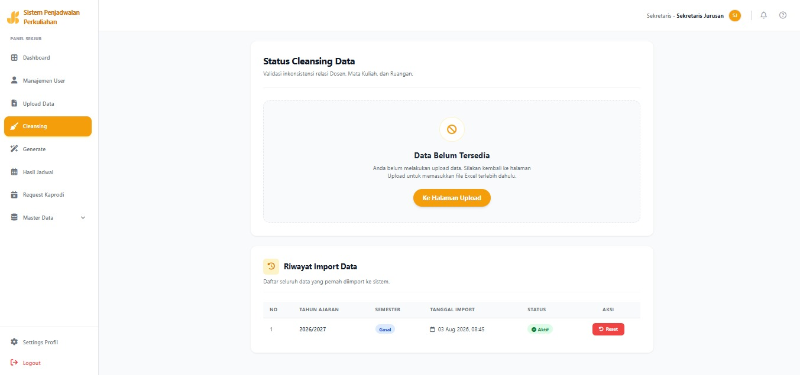
 <p><em>Halaman Cleansing [Sekretaris Jurusan] - halaman untuk meninjau, memvalidasi, dan memperbaiki inkonsistensi data seperti duplikasi, kolom kosong, atau format tidak sesuai sebelum data digunakan pada proses penjadwalan.</em></p>

 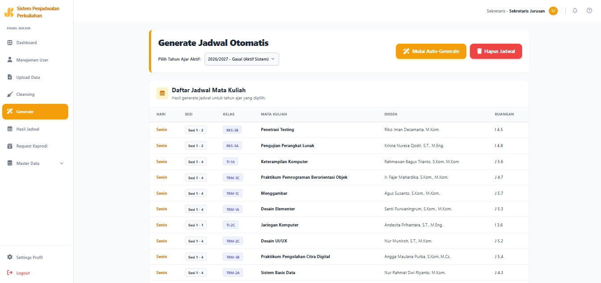
 <p><em>Halaman Generate [Sekretaris Jurusan] - halaman untuk mengeksekusi proses penjadwalan otomatis berbasis Google OR-Tools setelah seluruh data kurikulum dinyatakan valid.</em></p>

 
 <p><em>Halaman Hasil Jadwal [Sekretaris Jurusan] - halaman untuk melihat, menyaring, mengubah/menukar, serta mengunduh hasil jadwal perkuliahan yang telah berhasil dibuat sistem dalam format Excel maupun PDF.</em></p>

 
 <p><em>Halaman Request Kaprodi [Sekretaris Jurusan] - Halaman monitoring request Dosen tidak bersedia/tidak bisa mengajar yang akan dipakai saat generate jadwal.</em></p>

 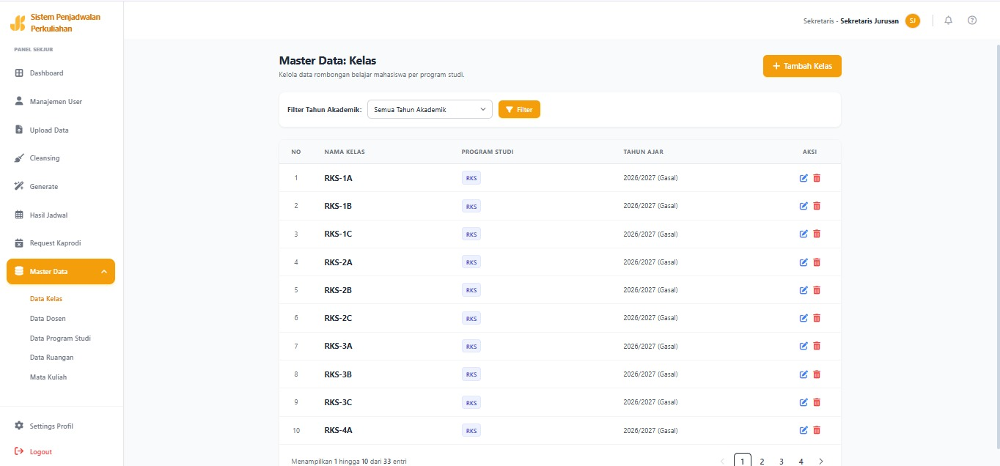
 <p><em>Halaman Master Data Kelas [Sekretaris Jurusan] - Halaman untuk menambah, mengedit, dan menghapus data kelas, dilengkapi fitur pencarian berdasarkan nama kelas dan filter berdasarkan tahun akademik. </em></p>

 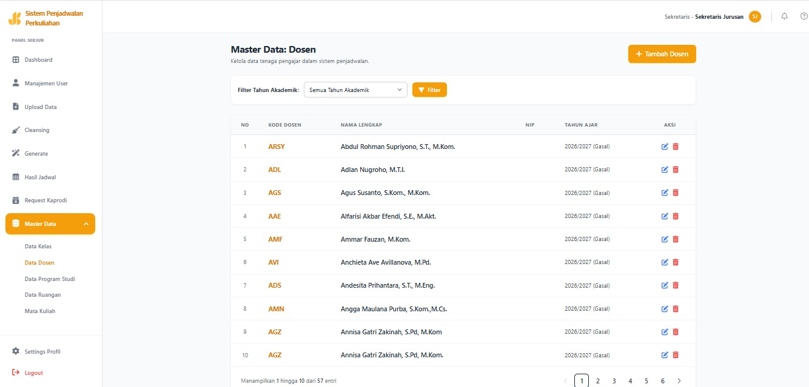
 <p><em>Halaman Master Data Dosen [Sekretaris Jurusan] - Halaman untuk menambah, mengedit, dan menghapus data dosen, dilengkapi fitur pencarian berdasarkan nama, NIP, atau kode dosen serta filter berdasarkan tahun akademik.</em></p>

 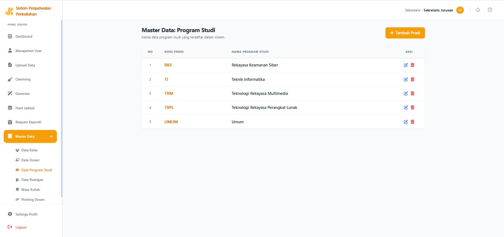
 <p><em>Halaman Master Data Program Studi [Sekretaris Jurusan] - Halaman untuk menambah, mengedit, dan menghapus data program studi.</em></p>

 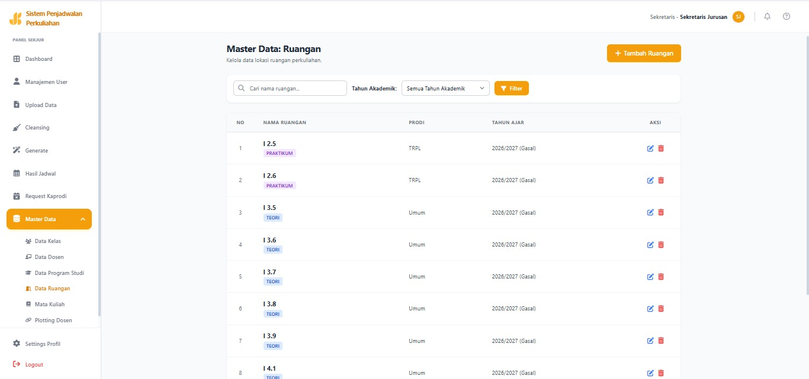
 <p><em>Halaman Master Data Ruangan [Sekretaris Jurusan] - Halaman untuk menambah, mengedit, dan menghapus data ruangan, dilengkapi fitur pencarian berdasarkan nama ruangan serta filter berdasarkan tahun akademik.</em></p>

 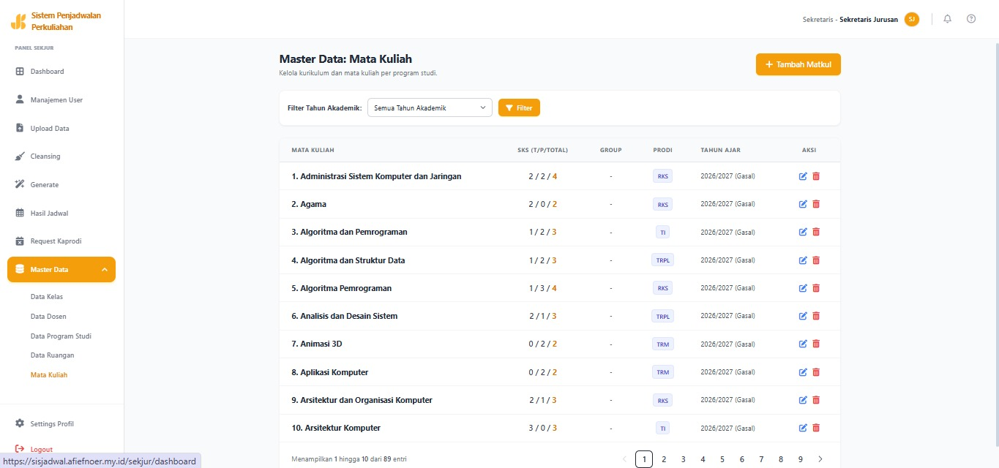
 <p><em>Halaman Master Data Mata Kuliah [Sekretaris Jurusan] - Halaman untuk menambah, mengedit, dan menghapus data mata kuliah, dilengkapi fitur pencarian berdasarkan nama mata kuliah serta filter berdasarkan tahun akademik.</em></p>

 
 <p><em>Halaman Master Data Plotting Dosen [Sekretaris Jurusan] - Halaman untuk mengelola relasi pengajaran antara Dosen, Mata Kuliah, dan Kelas secara manual, mencakup fitur tambah, edit, dan hapus data plotting dosen, dilengkapi pencarian berdasarkan nama, mata kuliah, atau kelas serta filter berdasarkan tahun akademik.</em></p>

 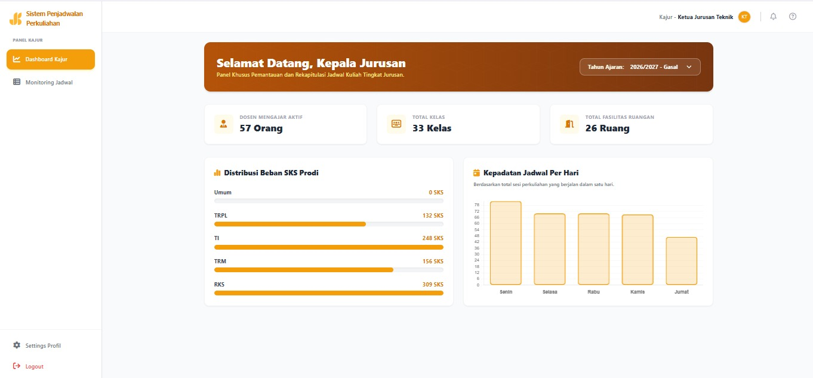
 <p><em>Halaman Dashboard [Kepala Jurusan] - Menampilkan statistik akademik tingkat jurusan berupa total dosen aktif, jumlah rombongan kelas, kapasitas ruangan, distribusi beban SKS per program studi, dan kepadatan jadwal harian.</em></p>

 
 <p><em>Halaman Monitoring Jadwal [Kepala Jurusan] - Halaman bagi Kepala Jurusan untuk meninjau keseluruhan matriks jadwal perkuliahan lintas program studi di lingkungan jurusan.</em></p>

 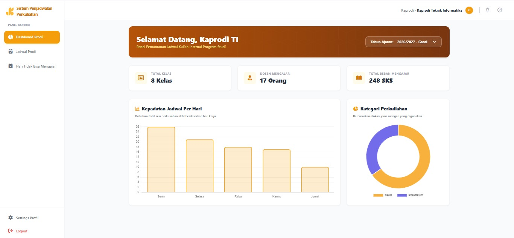
 <p><em>Halaman Dashboard Teknik Informatika [Koordinator Program Studi] - Menampilkan ringkasan data akademik secara interaktif yang spesifik pada program studi Teknik Informatika.</em></p>

 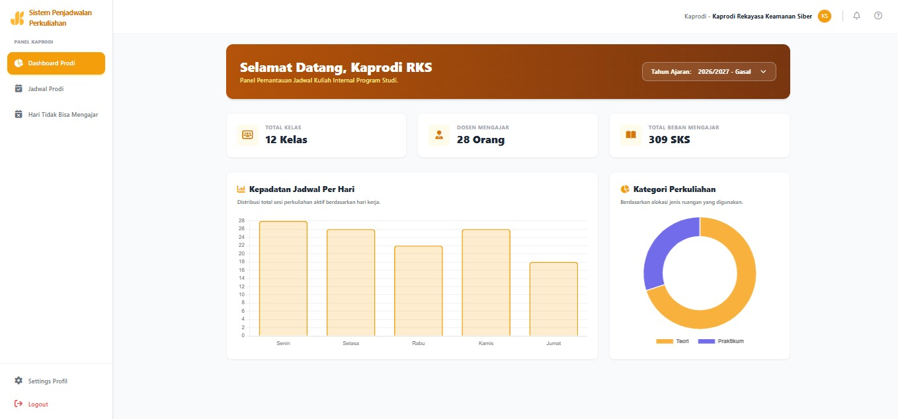
 <p><em>Halaman Dashboard Rekayasa Keamanan Siber [Koordinator Program Studi] - Menampilkan ringkasan data akademik secara interaktif yang spesifik pada program studi Rekayasa Keamanan Siber.</em></p>

 
 <p><em>Halaman Dashboard Teknik Rekayasa Perangkat Lunak [Koordinator Program Studi] - Menampilkan ringkasan data akademik secara interaktif yang spesifik pada program studi Teknik Rekayasa Perangkat Lunak.</em></p>

 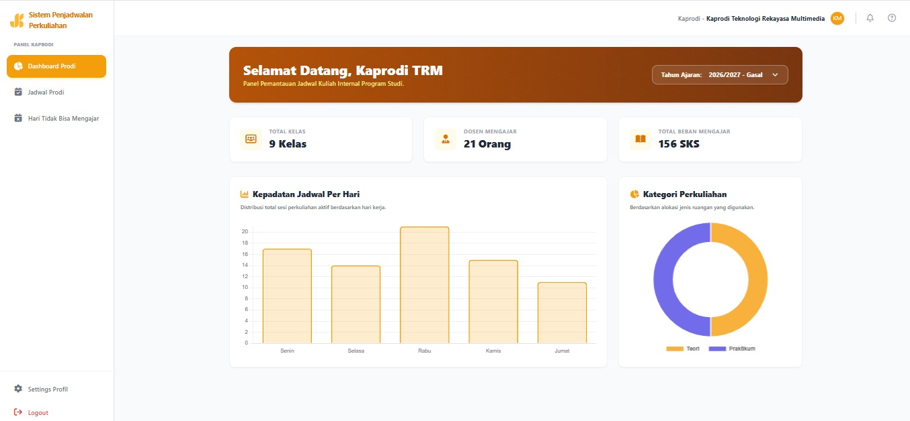
 <p><em>Halaman Dashboard Teknik Rekayasa Multimedia [Koordinator Program Studi] - Menampilkan ringkasan data akademik secara interaktif yang spesifik pada program studi Teknik Rekayasa Multimedia.</em></p>

 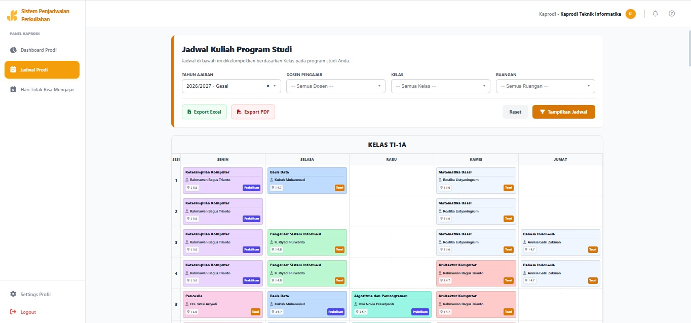
 <p><em>Halaman Monitoring Jadwal [Koordinator Program Studi] - halaman bagi Koordinator Program Studi untuk meninjau matriks jadwal perkuliahan khusus pada program studi yang diampunya.</em></p>

 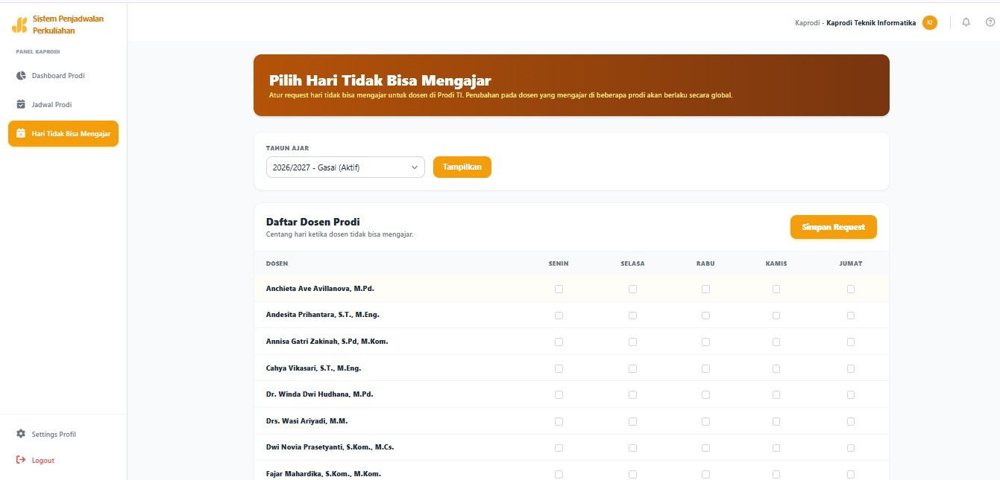
 <p><em>Halaman Hari Tidak Bisa Mengajar [Koordinator Program Studi] - Atur request hari tidak bisa mengajar untuk dosen di masing masing Program Studi. Perubahan pada dosen yang mengajar di beberapa prodi akan berlaku secara global.</em></p>

</div>

### Video Demo

## 📹 **[Link Video Demo](https://[URL_VIDEO])** _(opsional)_

---

## 🛠️ Teknologi

### Tech Stack

#### Frontend

```
Framework  : Blade (Laravel) & Alpine.js
UI Library : Tailwind CSS
State Mgmt : Alpine.js
Validation : Laravel Built-in Validation
Build Tool : Vite
```

#### Backend

```
Runtime    : PHP 8.3 & Python 3.12
Framework  : Laravel 12 & FastAPI
Database   : MySQL 8.0
ORM        : Eloquent
Auth       : Laravel Breeze (Session-based) & Role-based Middleware
```

#### DevOps & Tools

```
Deployment : Docker & Docker Compose
CI/CD      : Bash Script Automation (install.sh)
Testing    : Pest PHP
Monitoring : Laravel Default Logs
```

### Alasan Pemilihan Teknologi

| Teknologi                    | Alasan Pemilihan                                                                                                                                                                                                                                                                                                                                                                                                                                                                         |
| ---------------------------- | ---------------------------------------------------------------------------------------------------------------------------------------------------------------------------------------------------------------------------------------------------------------------------------------------------------------------------------------------------------------------------------------------------------------------------------------------------------------------------------------- |
| **Google OR-Tools (CP-SAT)** | Constraint Programming dipilih karena mampu menangani berbagai jenis batasan sekaligus, konflik jadwal dosen, konflik penggunaan ruang, dan keterbatasan ruang laboratoriu,cukup dengan mendeklarasikan aturan satu kali, solver akan otomatis mencari kombinasi jadwal yang memenuhi seluruh batasan tanpa pengecekan manual berulang. Solver CP-SAT digunakan sebagai mesin pencari solusi ini pada proses Auto-Generate Jadwal, dijalankan di backend Python setelah data divalidasi. |
| **Laravel 12**               | Dipilih sebagai backbone aplikasi web karena arsitektur MVC-nya memisahkan pengelolaan data, logika bisnis, dan tampilan secara terstruktur. Eloquent ORM digunakan untuk mengelola data akademik (dosen, mata kuliah, ruangan, kelas), Blade untuk menyusun dashboard multi-role, serta middleware autentikasi dan proteksi bawaan terhadap SQL Injection, CSRF, dan XSS yang relevan untuk sistem dengan banyak tingkat hak akses (Sekjur, Kajur, Kaprodi).                            |
| **FastAPI**                  | Dalam implementasinya, FastAPI digunakan sebagai layer backend Python terpisah yang menjalankan scheduling engine berbasis OR-Tools CP-SAT, berkomunikasi dengan aplikasi Laravel melalui REST API. Pemisahan ini menjaga proses komputasi penjadwalan yang berat tetap terpisah dari logika aplikasi web utama.                                                                                                                                                                         |
| **MySQL 8.0**                | Digunakan sebagai basis data relasional yang menyimpan seluruh data akademik (dosen, mata kuliah, ruangan, kelas, program studi) beserta hasil jadwal, dengan mekanisme Primary Key–Foreign Key yang menjaga relasi antar entitas tetap konsisten. Basis data ini diakses eksklusif oleh Laravel melalui Eloquent ORM, sehingga data yang telah divalidasi dapat diproses solver dan hasilnya tersimpan kembali untuk ditampilkan di dashboard.                                          |
| **Tailwind CSS**             | Dalam implementasinya, Tailwind CSS digunakan untuk membangun antarmuka dashboard yang berbeda untuk setiap role (Sekjur, Kajur, Kaprodi, serta halaman publik) secara konsisten dan responsif melalui utility classes, tanpa perlu menulis stylesheet kustom terpisah untuk tiap halaman.                                                                                                                                                                                               |
| **Alpine.js**                | Digunakan untuk menangani interaktivitas ringan di sisi clien,seperti toggle tampilan filter, transisi antar state, dan inisialisasi komponen (`x-data`, `x-show`, `x-transition`, `x-init`,yang cukup untuk kebutuhan UI dashboard berbasis Blade tanpa memerlukan framework JavaScript skala penuh.                                                                                                                                                                                    |
| **Docker & Docker Compose**  | Digunakan untuk menjalankan Laravel, layer Python (scheduling engine), dan MySQL sebagai layanan-layanan terpisah namun terintegrasi dalam satu lingkungan yang konsisten. Dengan ini, proses instalasi sistem multi-service dapat dilakukan melalui satu skrip instalasi (`install.sh`) tanpa konfigurasi manual di tiap komponen.                                                                                                                                                      |

### Dependencies Utama

```json
{
  "dependencies": {
    "laravel/framework": "^12.0",
    "barryvdh/laravel-dompdf": "^3.1",
    "maatwebsite/excel": "^3.1",
    "fastapi": ">=0.104.0",
    "ortools": ">=9.7"
  }
}
```

---

## 🏗️ Arsitektur Sistem

### System Architecture

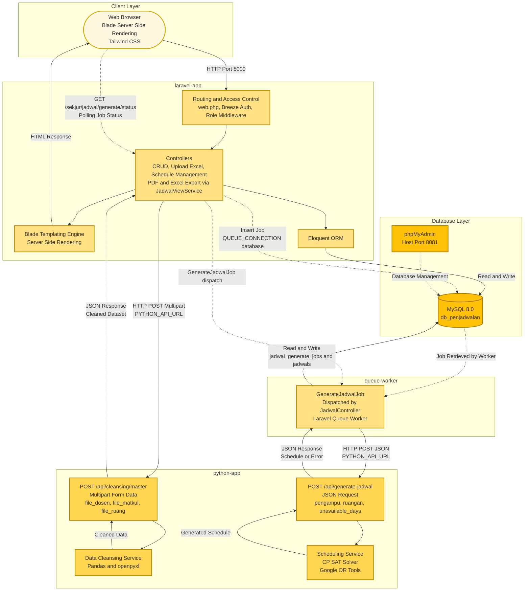

### Database Schema

```mermaid
erDiagram
    tahun_ajars {
        bigint id PK
        string tahun
        enum semester "Gasal, Genap"
        boolean is_active
        timestamp created_at
        timestamp updated_at
    }

    program_studis {
        bigint id PK
        string kode "nullable"
        string nama
        timestamp created_at
        timestamp updated_at
    }

    users {
        bigint id PK
        string nama
        string username "unique"
        string email "unique"
        string password
        enum role "sekretaris, kajur, kaprodi"
        bigint prodi_id FK "nullable"
        string remember_token "nullable"
        timestamp created_at
        timestamp updated_at
    }

    dosens {
        bigint id PK
        string kode_dosen "nullable"
        string nama
        string nip "nullable"
        bigint tahun_ajar_id FK "nullable"
        bigint homebase_prodi_id FK "nullable"
        timestamp created_at
        timestamp updated_at
    }

    mata_kuliahs {
        bigint id PK
        string nama
        tinyint sks_teori
        tinyint sks_praktikum
        tinyint sks_total
        string kode_group "nullable"
        bigint prodi_id FK
        bigint tahun_ajar_id FK "nullable"
        timestamp created_at
        timestamp updated_at
    }

    ruangs {
        bigint id PK
        string nama
        enum kategori "teori, praktikum"
        string spesifik_mk "nullable"
        bigint prodi_id FK "nullable"
        bigint tahun_ajar_id FK "nullable"
        timestamp created_at
        timestamp updated_at
    }

    kelas {
        bigint id PK
        string nama
        bigint prodi_id FK
        bigint tahun_ajar_id FK
        timestamp created_at
        timestamp updated_at
    }

    dosen_prodi {
        bigint id PK
        bigint dosen_id FK
        bigint prodi_id FK
        timestamp created_at
        timestamp updated_at
    }

    dosen_matkuls {
        bigint id PK
        bigint dosen_id FK
        bigint mata_kuliah_id FK
        bigint kelas_id FK
        bigint tahun_ajar_id FK
        timestamp created_at
        timestamp updated_at
    }

    jadwals {
        bigint id PK
        bigint tahun_ajar_id FK
        bigint dosen_id FK
        bigint mata_kuliah_id FK
        bigint kelas_id FK
        bigint ruang_id FK
        enum hari "Senin, Selasa, Rabu, Kamis, Jumat"
        tinyint sesi_mulai
        tinyint sesi_selesai
        timestamp created_at
        timestamp updated_at
    }

    dosen_unavailable_days {
        bigint id PK
        bigint user_id FK
        bigint dosen_id FK
        bigint prodi_id FK
        bigint tahun_ajar_id FK
        enum hari "Senin, Selasa, Rabu, Kamis, Jumat"
        timestamp created_at
        timestamp updated_at
    }

    jadwal_generate_jobs {
        bigint id PK
        bigint tahun_ajar_id FK
        enum status "pending, processing, completed, failed"
        text error_message "nullable"
        timestamp started_at "nullable"
        timestamp completed_at "nullable"
        timestamp created_at
        timestamp updated_at
    }

    program_studis ||--o{ users : "prodi_id"
    program_studis ||--o{ mata_kuliahs : "prodi_id"
    program_studis ||--o{ ruangs : "prodi_id"
    program_studis ||--o{ kelas : "prodi_id"
    program_studis ||--o{ dosen_prodi : "prodi_id"
    program_studis ||--o{ dosen_unavailable_days : "prodi_id"
    program_studis ||--o{ dosens : "homebase_prodi_id"

    tahun_ajars ||--o{ kelas : "tahun_ajar_id"
    tahun_ajars ||--o{ dosen_matkuls : "tahun_ajar_id"
    tahun_ajars ||--o{ jadwals : "tahun_ajar_id"
    tahun_ajars ||--o{ dosens : "tahun_ajar_id"
    tahun_ajars ||--o{ mata_kuliahs : "tahun_ajar_id"
    tahun_ajars ||--o{ ruangs : "tahun_ajar_id"
    tahun_ajars ||--o{ dosen_unavailable_days : "tahun_ajar_id"
    tahun_ajars ||--o{ jadwal_generate_jobs : "tahun_ajar_id"

    dosens ||--o{ dosen_prodi : "dosen_id"
    dosens ||--o{ dosen_matkuls : "dosen_id"
    dosens ||--o{ jadwals : "dosen_id"
    dosens ||--o{ dosen_unavailable_days : "dosen_id"

    mata_kuliahs ||--o{ dosen_matkuls : "mata_kuliah_id"
    mata_kuliahs ||--o{ jadwals : "mata_kuliah_id"

    kelas ||--o{ dosen_matkuls : "kelas_id"
    kelas ||--o{ jadwals : "kelas_id"

    ruangs ||--o{ jadwals : "ruang_id"

    users ||--o{ dosen_unavailable_days : "user_id"
```

### Folder Structure

```
sistem-penjadwalan/
├── docker-compose.yml              # Pengelolaan layanan container (MySQL, Laravel, Python, PMA)
├── install.sh                      # Script otomatisasi instalasi & setup environment
├── README.md                       # Dokumentasi utama proyek
├── sistem-penjadwalan-laravel/     # PRIMARY BACKEND & FRONTEND (Laravel 12)
│   ├── app/                        # Logika inti aplikasi (Controllers, Models, Middleware)
│   ├── artisan                     # CLI bawaan Laravel untuk menjalankan perintah artisan
│   ├── bootstrap/                  # Skrip inisialisasi framework dan konfigurasi cache
│   ├── composer.json               # Daftar dependensi utama backend PHP
│   ├── composer.lock               # Pengunci versi spesifik dependensi PHP
│   ├── config/                     # Berkas konfigurasi aplikasi, database, dan environment
│   ├── database/                   # Skrip migrasi dan seeder database MySQL
│   ├── Dockerfile                  # Instruksi build container untuk environment Laravel
│   ├── entrypoint.sh               # Script inisialisasi saat container Laravel pertama kali berjalan
│   ├── package.json                # Daftar dependensi frontend (Alpine.js, Axios, Tailwind)
│   ├── package-lock.json           # Pengunci versi spesifik dependensi Node.js
│   ├── phpunit.xml                 # Konfigurasi standar untuk testing PHP
│   ├── postcss.config.js           # Konfigurasi PostCSS untuk memproses Tailwind CSS
│   ├── public/                     # Aset statis dan entry point web (index.php)
│   ├── queue-worker-entrypoint.sh  # Script inisialisasi untuk memproses background jobs (queue)
│   ├── README.md                   # Dokumentasi spesifik untuk environment Laravel
│   ├── resources/                  # UI Frontend (Blade templates, CSS Tailwind, JS Alpine)
│   ├── routes/                     # Definisi rute web dan API (web.php)
│   ├── storage/                    # Penyimpanan log aplikasi dan file sementara (upload dataset)
│   ├── tailwind.config.js          # Konfigurasi kustomisasi styling Tailwind CSS
│   ├── tests/                      # Skrip pengujian otomatis (Pest PHP / PHPUnit)
│   └── vite.config.js              # Konfigurasi build tool frontend untuk asset bundling
└── sistem-penjadwalan-python/      # PROCESSING SERVICE (FastAPI 3.12)
    ├── __pycache__/                # File cache bytecode Python (ter-generate otomatis)
    ├── Dockerfile                  # Instruksi build container untuk environment Python
    ├── entrypoint.sh               # Script inisialisasi saat container Python berjalan
    ├── main.py                     # Entry point FastAPI & definisi endpoints API
    ├── requirements.txt            # Daftar dependensi Python (fastapi, ortools, pandas)
    ├── services/                   # Modul komputasi utama (Cleansing & Scheduling CP-SAT)
    └── src/                        # Direktori tambahan untuk utilitas spesifik Python
```

---

## ⚙️ Instalasi & Setup

### Prerequisites

Sistem ini diorkestrasi sepenuhnya menggunakan _container_. Pastikan Anda telah menginstall perangkat lunak berikut di komputer Anda:

- **Git**
- **Docker** (beserta Docker Compose)

### Langkah Instalasi

#### 1⃣ Metode Clone Repository

Jalankan serangkaian perintah berikut di terminal Anda:

```bash
git clone [https://github.com/afiffaizin/sistem-penjadwalan.git](https://github.com/afiffaizin/sistem-penjadwalan.git)
cd sistem-penjadwalan
bash install.sh
```

#### 2⃣ Metode Cepat

Atau, Anda dapat menjalankan perintah satu baris berikut untuk langsung mengeksekusi skrip dari internet tanpa perlu melakukan clone secara manual

```bash
curl -fsSL [https://raw.githubusercontent.com/afiffaizin/sistem-penjadwalan/main/install.sh](https://raw.githubusercontent.com/afiffaizin/sistem-penjadwalan/main/install.sh) | bash
```

## Aplikasi akan berjalan di `http://localhost:8000`

## 🚀 Penggunaan

### Menjalankan Aplikasi

### 1. Akses Aplikasi

Setelah proses instalasi selesai dan _container_ berjalan, layanan dapat diakses melalui peramban web pada tautan berikut:

| Layanan                      | URL                     | Fungsi                                     |
| :--------------------------- | :---------------------- | :----------------------------------------- |
| **Aplikasi Utama (Laravel)** | `http://localhost:8000` | Antarmuka sistem penjadwalan               |
| **Database UI (phpMyAdmin)** | `http://localhost:8081` | Manajemen dan visualisasi _database_ MySQL |

---

### 2. Akun Login Default (Testing)

Sistem ini telah dilengkapi dengan akun bawaan (_seeder_) untuk mempermudah pengujian fitur sesuai dengan batasan hak akses (_role-based access_). Silakan gunakan kredensial berikut:

| Username       | Password    | Role Akses                                 |
| :------------- | :---------- | :----------------------------------------- |
| `sekjur`       | `sekjur123` | Sekretaris Jurusan (Akses Penuh)           |
| `kajur`        | `kajur123`  | Ketua Jurusan                              |
| `kaprodi_ti`   | `ti123`     | Kaprodi Teknik Informatika                 |
| `kaprodi_rks`  | `rks123`    | Kaprodi Rekayasa Keamanan Siber            |
| `kaprodi_trm`  | `trm123`    | Kaprodi Teknik Rekayasa Multimedia         |
| `kaprodi_trpl` | `trpl123`   | Kaprodi Teknologi Rekayasa Perangkat Lunak |

---

### 3. Referensi Perintah Docker

Berikut adalah kumpulan perintah utilitas untuk mengelola _container_ aplikasi di lingkungan _development_:

```bash
# Menghentikan semua container (Data database tetap aman)
docker compose down

# Menghidupkan kembali seluruh layanan tanpa build ulang
docker compose up -d

# Melihat aktivitas log semua layanan secara real-time
docker compose logs -f

# Melihat log khusus untuk layanan tertentu (berguna untuk debugging)
docker compose logs -f laravel-app
docker compose logs -f python-app

# Mem-build ulang container (Wajib dilakukan jika ada perubahan pada source code)
docker compose up -d --build

# Menghentikan layanan sekaligus MENGHAPUS SELURUH ISI DATABASE
docker compose down -v
```

### User Guide

#### 1. Pengguna Umum (Publik)

Pengguna umum (dosen dan mahasiswa) dapat melihat jadwal tanpa perlu melakukan proses masuk (_login_).

- **Pencarian Jadwal:** Pada halaman utama (_Landing Page_), gunakan _dropdown_ filter yang tersedia (Program Studi, Dosen Pengajar, Kelas, dan Ruangan) untuk mencari jadwal spesifik.
- **Menampilkan Jadwal:** Setelah filter dipilih, klik tombol **Tampilkan Jadwal**. Sistem akan menampilkan matriks jadwal dari hari Senin hingga Jumat (8 sesi per hari).
- **Mengatur Ulang Filter:** Klik tombol **Reset** untuk mengosongkan kembali pilihan pencarian.
- **Unduh Jadwal:** Hasil jadwal yang tampil dapat diunduh secara luring dengan menekan tombol **Unduh Excel** atau **Unduh PDF**.
- **Akses Sistem (Admin):** Untuk pengelola, klik tombol **Login Sistem** di pojok kanan atas, masukkan _Username_ dan _Password_, lalu klik **Masuk Dashboard**.

#### 2. Sekretaris Jurusan (Operator Utama)

Sekretaris Jurusan memiliki kontrol penuh terhadap _master data_ dan otomatisasi jadwal.

##### A. Pemantauan Dashboard

- Menampilkan ringkasan data akademik secara _real-time_ (Total Dosen, Total Mata Kuliah, dan Total Ruangan).
- Dilengkapi grafik visual, termasuk persentase Tipe Mata Kuliah (Teori/Praktikum/Hybrid) dan peringkat _Top 5_ Dosen dengan beban SKS tertinggi.

##### B. Otomatisasi Penjadwalan

1.  **Upload Data:**
    - Masuk ke menu **Upload Data**. Pilih _Tahun Ajar_ dan _Semester_.
    - Unggah 3 _file_ Excel utama (`dosen_mk`, `matkul_sks`, `ruang`). _Template_ Excel dapat diunduh melalui tombol **Unduh Template Excel**.
    - Klik **Upload dan Mulai Cleansing**.
2.  **Data Cleansing:** Sistem akan menampilkan kartu indikator jumlah data yang _Valid_ dan _Error_. Jika semua data sudah tervalidasi, klik **Lanjutkan ke Generate**.
3.  **Generate Jadwal:** Pada halaman ini, klik **Mulai Auto-Generate** untuk menjalankan mesin optimasi _Constraint Programming_. Tabel pratinjau akan langsung muncul saat proses selesai.
4.  **Manajemen Hasil Jadwal:** Masuk ke menu **Lihat Jadwal**. Anda dapat memfilter hasil, mengunduh cetakan PDF/Excel, atau menggunakan fitur **Ubah/Tukar Jadwal** untuk memindahkan jadwal secara manual (sistem akan mendeteksi jika terjadi konflik).

##### C. Kelola Master Data & User

Melalui menu _Sidebar_, Sekretaris Jurusan dapat mengelola data inti sistem:

- **Master Kelas, Dosen, Prodi, Ruang, & Matkul:** Klik tombol **+ Tambah [Data]** untuk memasukkan data baru, atau gunakan ikon **Pensil (Edit)** dan **Tempat Sampah (Hapus)** pada tabel untuk memperbarui/menghapus data.
- **Manajemen User:** Digunakan untuk mendaftarkan akun fungsionaris (Kajur/Kaprodi). Sistem secara otomatis akan menampilkan pilihan program studi jika _role_ yang dipilih adalah Kaprodi.

#### 3. Kepala Jurusan (Pemantau Tingkat Jurusan)

Kepala Jurusan memiliki hak akses untuk memantau aktivitas akademik secara menyeluruh di semua program studi.

- **Dashboard Analitik:** Menyajikan indikator total dosen aktif, rombongan kelas, dan kapasitas ruangan. Dilengkapi grafik distribusi beban SKS antar program studi dan kepadatan sesi jadwal perkuliahan per hari.
- **Monitoring Jadwal Lintas Prodi:** Masuk ke menu **Monitoring Jadwal**. Gunakan filter pencarian lintas program studi untuk meninjau secara mendalam persebaran jadwal di seluruh lingkungan Jurusan. Klik **Tampilkan Jadwal** untuk mengeksekusi pencarian.

#### 4. Koordinator Program Studi (Pemantau Tingkat Prodi)

Koordinator Program Studi (Kaprodi) memiliki wawasan spesifik yang secara otomatis difilter sesuai dengan program studi yang dipimpinnya.

- **Dashboard Spesifik Prodi:** Menampilkan total Dosen Pengampu, Mata Kuliah, dan Rombongan Kelas khusus untuk prodi terkait. Dilengkapi persentase tipe mata kuliah dan grafik _Top 5_ beban mengajar SKS dosen di prodi tersebut.
- **Monitoring & Ekspor Jadwal:** Masuk ke menu **Monitoring Jadwal** untuk melihat alokasi ruangan dan jadwal kelas prodinya. Kaprodi dapat menyaring jadwal berdasarkan Kelas, Dosen, atau Ruangan, lalu mengekspor datanya melalui tombol **Export Excel/PDF** untuk keperluan laporan.

---

## 📚 API Documentation

### Base URL

```
Internal (Laravel FastAPI, dalam Docker network)   : http://python-app:8000
External FastAPI (host, untuk testing manual)      : http://localhost:8080
Laravel Web Application                            : http://localhost:8000
```

### Endpoints

#### Data Cleansing & Scheduling

```http
POST /api/cleansing/master
POST /api/generate-jadwal
```

#### Generate Jadwal (Session-based, role: sekretaris jurusan)

```http
POST /sekjur/jadwal/generate/process
GET  /sekjur/jadwal/generate/status
```

### Example Request

```javascript
const response = await fetch(
  "http://localhost:8000/sekjur/jadwal/generate/process",
  {
    method: "POST",
    headers: {
      "Content-Type": "application/json",
      "X-CSRF-TOKEN": document.querySelector('meta[name="csrf-token"]').content,
    },
    body: JSON.stringify({
      tahun_ajar_id: 1,
    }),
  },
);
```

## 📖 **[Dokumentasi API Lengkap](./docs/API.md)**

## 🧪 Testing

### Running Tests

```bash
# Unit tests
npm run test
# Integration tests
npm run test:integration
# E2E tests
npm run test:e2e
# Test coverage
npm run test:coverage
```

### Test Coverage

```
Statements : XX%
Branches : XX%
Functions : XX%
Lines : XX%
```

---

## 📄 Lisensi

Proyek ini dilisensikan di bawah [MIT License](LICENSE) - lihat file LICENSE untuk detail
lebih lanjut.

---

<div align="center">
 **Made with ❤️ by 404 forbidden for ITECHNO CUP 2026**

</div>
