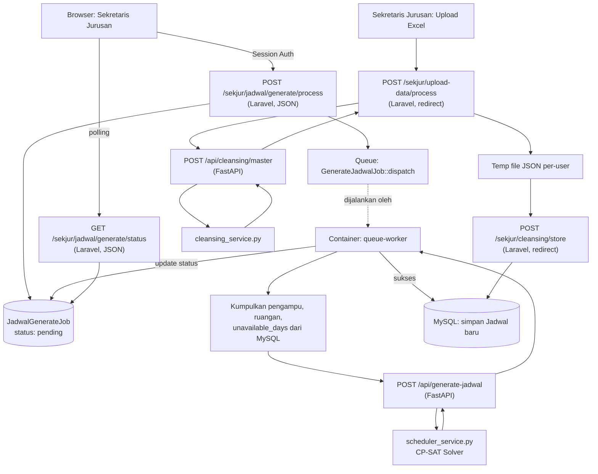

## 📚 API Documentation

### 🔗 Base URL

| Service                                                       | Base URL                                                            |     |
| ------------------------------------------------------------- | ------------------------------------------------------------------- | --- |
| Laravel Web Application                                       | `http://localhost:8000` (host) / port internal `80` (`laravel-app`) |     |
| FastAPI Service (internal, dipanggil Laravel)                 | `http://python-app:8000`                                            |     |
| FastAPI Service (akses dari luar Docker, mis. testing manual) | `http://localhost:8080`                                             |     |

<!-- > Fallback default di kode bila `PYTHON_API_URL` tidak diset: `http://127.0.0.1:8080` (`services.php`) - hanya relevan untuk pengembangan lokal tanpa Docker. -->

### 🔐 Authentication

Sistem menggunakan **Web Authentication / Session-based Authentication** melalui Laravel Breeze (`auth.php`):

- `GET/POST /login`
- `GET/POST /forgot-password`
- `GET /reset-password/{token}`, `POST /reset-password`
- `GET /verify-email`, `GET /verify-email/{id}/{hash}`, `POST /email/verification-notification`
- `GET/POST /confirm-password`
- `PUT /password`
- `POST /logout`

### 📡 API Endpoints

---

#### 1. Cleansing Data Master

##### Request

`POST /api/cleansing/master`
**Service:** FastAPI
**Purpose:** Membersihkan dan memvalidasi 3 berkas data master (dosen, mata kuliah, ruangan) sebelum digunakan pada proses penjadwalan.

##### Authentication

Tidak ada.

##### Parameters

Tidak ada path/query parameter.

##### Request Body

Content-Type: `multipart/form-data`

| Field         | File Type  | Required | Description             |
| ------------- | ---------- | -------- | ----------------------- |
| `file_dosen`  | UploadFile | Ya       | Berkas data dosen       |
| `file_matkul` | UploadFile | Ya       | Berkas data mata kuliah |
| `file_ruang`  | UploadFile | Ya       | Berkas data ruangan     |

##### Example Request

```bash
curl -X POST http://python-app:8000/api/cleansing/master \
  -F "file_dosen=@dosen.xlsx" \
  -F "file_matkul=@matkul.xlsx" \
  -F "file_ruang=@ruang.xlsx"
```

##### Success Response

`200 OK`

```json
{
  "status": "success",
  "pesan": "3 File Master berhasil dibersihkan",
  "data": {
    "pengampu": [
      {
        "nip": "",
        "kode_dosen": "D01",
        "nama_dosen": "Nama Dosen, S.Kom., M.Kom.",
        "nama_mk": "Pemrograman Web",
        "sks_teori": 2,
        "sks_praktikum": 1,
        "kelas": "TI-1A",
        "prodi": "TI",
        "kode_group": ""
      }
    ],
    "ruangan": [
      {
        "ruang": "Lab 1",
        "kategori": "praktikum",
        "prodi": "TI",
        "spesifik_mk": ""
      }
    ],
    "mata_kuliah": [
      {
        "nama_mk": "Pemrograman Web",
        "sks_teori": 2,
        "sks_praktikum": 1,
        "sks_total": 3,
        "prodi": "TI",
        "kode_group": ""
      }
    ]
  }
}
```

##### Error Response

`500 Internal Server Error`

```json
{
  "status": "error",
  "message": "Gagal memproses data: <pesan exception>"
}
```

##### Response Fields

| Field                | Type            | Description                                                                                                                    |
| -------------------- | --------------- | ------------------------------------------------------------------------------------------------------------------------------ |
| `status`             | string          | `"success"` atau `"error"`                                                                                                     |
| `pesan`              | string          | Pesan konfirmasi (hanya pada success)                                                                                          |
| `data.pengampu[]`    | array of object | Field terjamin ada: `nip`, `kode_dosen`, `nama_dosen`, `nama_mk`, `sks_teori`, `sks_praktikum`, `kelas`, `prodi`, `kode_group` |
| `data.mata_kuliah[]` | array of object | `nama_mk`, `sks_teori`, `sks_praktikum`, `sks_total`, `prodi`, `kode_group`                                                    |
| `data.ruangan[]`     | array of object | Field terjamin ada: `ruang`, `kategori`, `prodi`, `spesifik_mk`                                                                |
| `message`            | string          | Pesan error (hanya pada error)                                                                                                 |

##### Internal Service Communication

Dipanggil oleh Laravel `UploadExcelController::process()`:

```php
Http::timeout(120)
    ->attach('file_dosen', ...)->attach('file_matkul', ...)->attach('file_ruang', ...)
    ->post(config('services.python.url') . '/api/cleansing/master');
```

---

#### 2. Generate Jadwal (OR-Tools / CP-SAT)

##### Request

`POST /api/generate-jadwal`
**Service:** FastAPI
**Purpose:** Menjalankan solver Constraint Programming (CP-SAT) untuk menyusun jadwal otomatis berdasarkan data pengampu, ruangan, dan hari tidak bisa mengajar.

##### Authentication

Tidak ada.

##### Parameters

Tidak ada path/query parameter.

##### Request Body

Content-Type: `application/json`

```json
{
  "pengampu": [
    {
      "id": 1,
      "dosen_id": 3,
      "dosen_nama": "Nama Dosen",
      "mata_kuliah_id": 10,
      "mata_kuliah_nama": "Pemrograman Web",
      "group_matkul": "-",
      "kelas_id": 2,
      "kelas_nama": "TI-1A",
      "tahun_ajar_id": 1,
      "prodi_id": 1,
      "jam_teori": 2,
      "jam_praktikum": 2
    }
  ],
  "ruangan": [
    {
      "id": 5,
      "nama": "Lab 1",
      "kategori": "praktikum",
      "prodi_id": 1,
      "spesifik_mk": null
    }
  ],
  "unavailable_days": [{ "dosen_id": 3, "hari": "Jumat" }]
}
```

| Field              | Type            | Required                                    | Description                                                                                                                                                                                                              |
| ------------------ | --------------- | ------------------------------------------- | ------------------------------------------------------------------------------------------------------------------------------------------------------------------------------------------------------------------------ |
| `pengampu`         | array of object | Tidak wajib secara teknis (`.get(..., [])`) | Beban mengajar per dosen-matkul-kelas. Elemen: `id`, `dosen_id`, `dosen_nama`, `mata_kuliah_id`, `mata_kuliah_nama`, `group_matkul`, `kelas_id`, `kelas_nama`, `tahun_ajar_id`, `prodi_id`, `jam_teori`, `jam_praktikum` |
| `ruangan`          | array of object | Sama seperti di atas                        | Data ruangan tersedia. Elemen: `id`, `nama`, `kategori`, `prodi_id`, `spesifik_mk`                                                                                                                                       |
| `unavailable_days` | array of object | Tidak wajib, default `[]`                   | Hari yang tidak bisa dipakai mengajar per dosen. Elemen: `dosen_id`, `hari`                                                                                                                                              |

##### Example Request

```bash
curl -X POST http://python-app:8000/api/generate-jadwal \
  -H "Content-Type: application/json" \
  -d '{"pengampu": [...], "ruangan": [...], "unavailable_days": [...]}'
```

##### Success Response

`200 OK` (status solver berhasil)

```json
{
  "status_solver": "SUKSES",
  "pesan": "Berhasil",
  "data": [
    {
      "pengampu_id": 1,
      "dosen_id": 3,
      "mata_kuliah_id": 10,
      "kelas_id": 2,
      "tahun_ajar_id": 1,
      "ruang_id": 5,
      "hari": "Senin",
      "sesi_mulai": 1,
      "sesi_selesai": 2
    }
  ]
}
```

##### Error Response - 2 Bentuk Berbeda

**(a) Kegagalan logis solver** - tetap `200 OK` (bukan HTTP error, karena `main.py` langsung meneruskan return value `scheduler_service`):

```json
{
  "status_solver": "GAGAL",
  "pesan": "Terjadi bentrok pada batasan penjadwalan.",
  "data": [],
  "violations": [
    "Sistem tidak dapat menemukan kombinasi jadwal yang valid tanpa bentrok untuk dosen, kelas, dan ruangan yang ada.",
    "Hal ini biasanya terjadi karena keterbatasan waktu (contoh: dosen mengajar terlalu banyak kelas atau terlalu banyak hari yang diblokir)."
  ],
  "recommendation": "Silakan tinjau kembali beban mengajar dosen, kurangi hari tidak mengajar yang diblokir, atau sesuaikan jumlah mata kuliah."
}
```

Penyebab lain yang menghasilkan bentuk sama (`pesan` berbeda-beda): kategori ruangan tidak ditemukan, kapasitas ruangan tidak cukup, beban mengajar dosen melebihi kapasitas, total sesi kelas melebihi batas mingguan, durasi mata kuliah melebihi batas sesi harian, solver timeout (900 detik), model tidak valid, atau tidak ada data beban mengajar sama sekali.

**(b) Exception Python tak terduga** - `500 Internal Server Error`:

```json
{
  "status": "error",
  "status_solver": "GAGAL",
  "pesan": "Terjadi kesalahan server yang tidak terduga.",
  "violations": [
    "Kesalahan internal server mencegah proses penjadwalan selesai."
  ],
  "recommendation": "Silakan coba lagi. Jika masalah berlanjut, hubungi administrator sistem."
}
```

##### Response Fields

| Field            | Type            | Description                                                                                                                                                          |
| ---------------- | --------------- | -------------------------------------------------------------------------------------------------------------------------------------------------------------------- |
| `status_solver`  | string          | `"SUKSES"` atau `"GAGAL"`                                                                                                                                            |
| `pesan`          | string          | Pesan status/penyebab kegagalan                                                                                                                                      |
| `data`           | array of object | Hasil jadwal (kosong jika gagal). Elemen: `pengampu_id`, `dosen_id`, `mata_kuliah_id`, `kelas_id`, `tahun_ajar_id`, `ruang_id`, `hari`, `sesi_mulai`, `sesi_selesai` |
| `violations`     | array of string | Daftar alasan kegagalan (hanya saat gagal)                                                                                                                           |
| `recommendation` | string          | Saran tindak lanjut (hanya saat gagal)                                                                                                                               |
| `status`         | string          | Hanya muncul pada exception tak terduga (500), nilainya `"error"`                                                                                                    |

##### Internal Service Communication

```php
Http::timeout(960)->post(config('services.python.url') . '/api/generate-jadwal', [
    'pengampu' => $pengampu, 'ruangan' => $ruangan, 'unavailable_days' => $unavailableDays,
]);
```

---

#### 3. Generate Jadwal

##### Request

`POST /sekjur/jadwal/generate/process`
**Service:** Laravel (Internal JSON Endpoint)
**Purpose:** Memulai proses generate jadwal secara asynchronous (dispatch queue job), bukan memanggil FastAPI secara langsung.

##### Authentication

Session-based (`auth`, `verified` middleware).

##### Authorization

Role `sekretaris` (inline check di `web.php`; selain role ini akan menerima `403 Forbidden`).

##### Content-Type

`application/x-www-form-urlencoded` atau `application/json` (dibaca via `$request->input()`, tidak spesifik satu Content-Type).

##### Request Body

| Field           | Type    | Required | Description                                    |
| --------------- | ------- | -------- | ---------------------------------------------- |
| `tahun_ajar_id` | integer | Ya       | ID tahun ajaran yang akan digenerate jadwalnya |

##### Success Response

`200 OK`

```json
{
  "status": "success",
  "message": "Proses generate jadwal dimulai.",
  "job_id": 15
}
```

##### Error Response

`422 Unprocessable Content` - `tahun_ajar_id` kosong/tidak valid:

```json
{ "status": "error", "message": "Tahun Ajar tidak valid." }
```

`409 Conflict` - sudah ada job aktif untuk tahun ajar yang sama:

```json
{
  "status": "error",
  "message": "Proses generate jadwal untuk tahun ajar ini sedang berjalan. Silakan tunggu hingga selesai."
}
```

##### Response Fields

| Field     | Type    | Description                                                                    |
| --------- | ------- | ------------------------------------------------------------------------------ |
| `status`  | string  | `"success"` atau `"error"`                                                     |
| `message` | string  | Pesan status                                                                   |
| `job_id`  | integer | ID record `JadwalGenerateJob` untuk dipakai polling status (hanya pada sukses) |

##### Database/Side Effect

Membuat record baru di tabel `JadwalGenerateJob` (`status: pending`), lalu `GenerateJadwalJob::dispatch($tahunAjarId, $tracker->id)` ke queue (`QUEUE_CONNECTION=database`).

##### Internal Service Communication

## Tidak memanggil FastAPI secara langsung

#### 4. Generate Jadwal

##### Request

`GET /sekjur/jadwal/generate/status`
**Service:** Laravel (Internal JSON Endpoint)
**Purpose:** Polling status proses generate jadwal yang sedang/sudah berjalan.

##### Authentication

Session-based (`auth`, `verified` middleware).

##### Authorization

Role `sekretaris`.

##### Query Parameters

| Field           | Type    | Required | Description                                |
| --------------- | ------- | -------- | ------------------------------------------ |
| `tahun_ajar_id` | integer | Ya       | ID tahun ajaran yang ingin dicek statusnya |

##### Request Body

None (GET request).

##### Success Response

`200 OK` - belum pernah ada job untuk tahun ajar ini:

```json
{ "job_status": "none" }
```

`200 OK` - job ditemukan:

```json
{
  "job_id": 15,
  "job_status": "completed",
  "error_message": null,
  "started_at": "2026-08-28 10:00:00",
  "completed_at": "2026-08-28 10:07:32",
  "created_at": "2026-08-28 09:59:50"
}
```

##### Error Response

`422 Unprocessable Content`:

```json
{ "status": "error", "message": "Tahun Ajar tidak valid." }
```

##### Response Fields

| Field           | Type                      | Description                                                             |
| --------------- | ------------------------- | ----------------------------------------------------------------------- |
| `job_id`        | integer                   | ID job (tidak ada jika `job_status: "none"`)                            |
| `job_status`    | string                    | Salah satu dari: `none`, `pending`, `processing`, `completed`, `failed` |
| `error_message` | string \| null            | Pesan error jika `job_status: failed`                                   |
| `started_at`    | string (datetime) \| null | Waktu job mulai diproses worker                                         |
| `completed_at`  | string (datetime) \| null | Waktu job selesai (sukses maupun gagal)                                 |
| `created_at`    | string (datetime)         | Waktu job dibuat (saat trigger di Endpoint #3)                          |

---

### API Flow



### API Summary

| Method | Endpoint                          | Service | Purpose                                                       |
| ------ | --------------------------------- | ------- | ------------------------------------------------------------- |
| POST   | `/api/cleansing/master`           | FastAPI | Membersihkan/memvalidasi 3 file master (dosen, matkul, ruang) |
| POST   | `/api/generate-jadwal`            | FastAPI | Menjalankan solver CP-SAT untuk generate jadwal               |
| POST   | `/sekjur/jadwal/generate/process` | Laravel | Trigger proses generate jadwal (dispatch queue job)           |
| GET    | `/sekjur/jadwal/generate/status`  | Laravel | Polling status proses generate jadwal                         |

---
